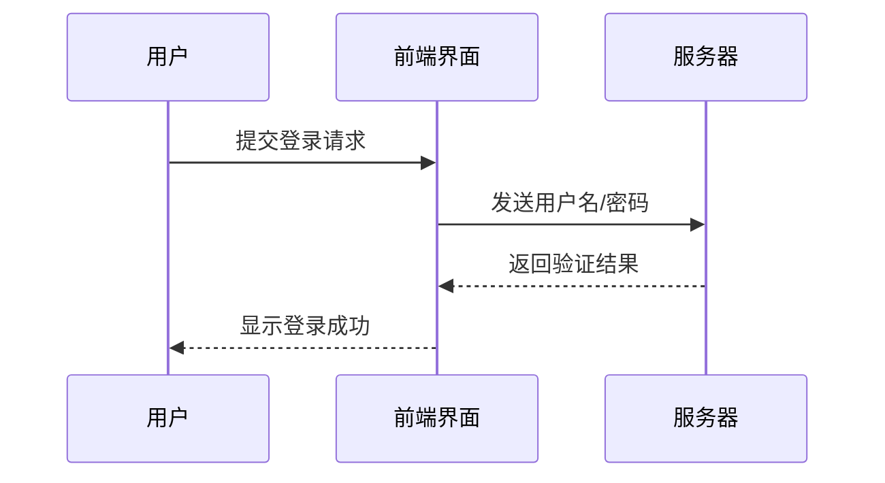
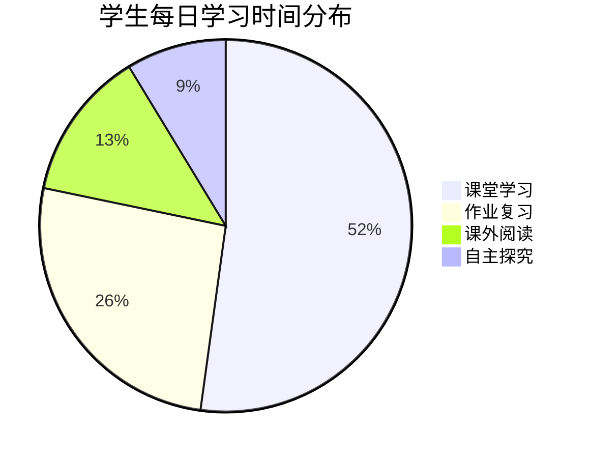
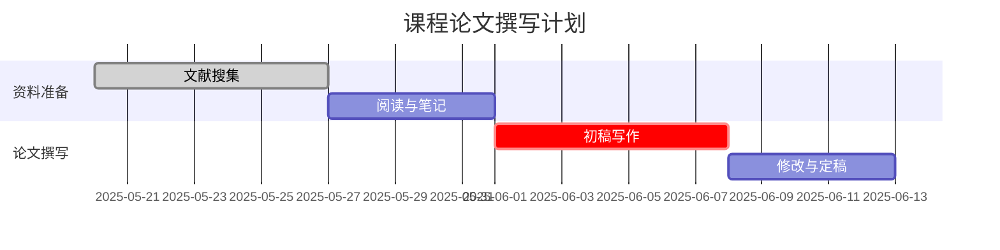

# 用 Mermaid 在 Markdown 中绘制图表：告别繁琐绘图，拥抱高效表达

!!! info "AI生成声明"
    本篇文章由AI生成

!!! warning "注意"
    本文章的**原始Markdown文件**需要在支持Mermaid渲染的Markdown查看器中查看
    
    （本站的此页面已内置Mermaid渲染引擎，只要现代浏览器就行了）

<script type="module">
    import mermaid from 'https://cdn.jsdelivr.net/npm/mermaid@11/dist/mermaid.esm.min.mjs';
    mermaid.initialize({ startOnLoad: true });
</script>

在日常学习、文档编写或知识整理中，我们常常需要绘制流程图、时序图等图表来清晰地表达逻辑。然而，传统的绘图方式存在几个核心痛点：

- **工具依赖强**：需要安装和学习专业的绘图软件。
- **修改成本高**：任何细微的调整都可能需要重新拖动、对齐和排版。
- **协作不便利**：图片文件难以进行版本对比，也无法被AI直接理解和处理。

**Mermaid** 的出现，完美地解决了这些问题。它是一个基于 JavaScript 的图表绘制工具，通过简单的文本代码，就能生成标准化的图表。最重要的是，它能在所有支持 Markdown 的环境中原生使用。

## 一、初识 Mermaid：从代码到图表

让我们通过一个具体的数学问题来直观感受 Mermaid。下图所示为一个运算程序：

<pre class="mermaid">
flowchart LR
    Input[/输入x/] --> Pow[x³]
    Pow --> Decision{x³ < 10?}
    Decision -->|No| Sub[减8] --> Div[除以4] --> Output[/输出/]
    Decision -->|Yes| Add[加3] --> Mult[乘4] --> Output
</pre>

**问题**：若输入的值为 -2，则输出的值为多少？

**求解过程**：

1.  输入 \( x = -2 \)
2.  执行立方运算：\( (-2)^3 = -8 \)
3.  判断 \( -8 < 10 \) 为真，进入“是”分支
4.  执行加 3：\( -8 + 3 = -5 \)
5.  执行乘 4：\( -5 \times 4 = -20 \)

**答案**：输出值为 **-20**。

通过这个例子，你不仅理解了题目逻辑，也看到了 Mermaid 流程图是如何清晰地将程序结构可视化的。

## 二、Mermaid 的核心应用场景

Mermaid 的功能远不止于绘制流程图。它涵盖了多种常用图表类型，能满足你在学习和工作中的大部分可视化需求。

### 1. 序列图：清晰展示交互时序

序列图非常适合描述对象之间消息传递的时间顺序，比如理解一个系统的运作流程。

````markdown

````

<pre class="mermaid">
sequenceDiagram
    participant User as 用户
    participant Front as 前端界面
    participant Server as 服务器

    User->>Front: 提交登录请求
    Front->>Server: 发送用户名/密码
    Server-->>Front: 返回验证结果
    Front-->>User: 显示登录成功
</pre>

### 2. 饼图：直观呈现数据分布

使用饼图可以轻松展示各部分在整体中所占的比例。

````markdown

````

<pre class="mermaid">
pie title 学生每日学习时间分布
    "课堂学习" : 6
    "作业复习" : 3
    "课外阅读" : 1.5
    "自主探究" : 1
</pre>

### 3. 甘特图：高效管理项目进度

甘特图是项目规划和时间管理的利器，非常适合用来制定学习计划或课程设计。

````markdown

````

<pre class="mermaid">
gantt
    title 课程论文撰写计划
    dateFormat YYYY-MM-DD
    section 资料准备
    文献搜集 :done, 2025-05-20, 7d
    阅读与笔记 :2025-05-27, 5d
    section 论文撰写
    初稿写作 :crit, 2025-06-01, 7d
    修改与定稿 :2025-06-08, 5d
</pre>

## 三、如何开始使用 Mermaid？

掌握 Mermaid 非常简单，你可以通过以下几种方式立即开始体验：

1.  **在线编辑器（推荐入门）**
    访问 [Mermaid Live Editor](https://mermaid.live)，这是官方的在线编辑平台。你可以在左侧编写代码，右侧实时预览图表效果，无需任何配置。

2.  **在常用工具中集成**
    - **VS Code**：安装 `Mermaid` 预览插件，即可在编辑 Markdown 文件时直接预览和导出图表。
    - **Notion**：Notion 原生支持 Mermaid。只需创建一个代码块，并将语言选择为 Mermaid 即可。
    - **GitHub / GitLab**：在这些平台的 Markdown 文件（如 `README.md`）中，Mermaid 代码块会自动被渲染为图表。

## 四、为什么 Mermaid 是更优的选择？

回顾开篇提到的痛点，Mermaid 带来了革命性的优势：

- **解放生产力**：专注于内容和逻辑，而非图形排版。
- **文本的威力**：图表代码可以用 Git 进行版本管理，轻松追踪每一次修改，方便团队协作。
- **面向未来**：纯文本格式使得 AI 大语言模型能够完美地理解、生成和修改你的图表，极大地提升了创作效率。

## 总结

Mermaid 不仅仅是一个绘图工具，更是一种全新的高效表达范式。它将图表的创建过程从“绘画”变成了“写作”，极大地降低了制作和维护复杂图表的门槛。

现在，你就可以打开一个支持 Mermaid 的编辑器，尝试将你的下一个想法或项目计划，用代码可视化成一张清晰的图表。